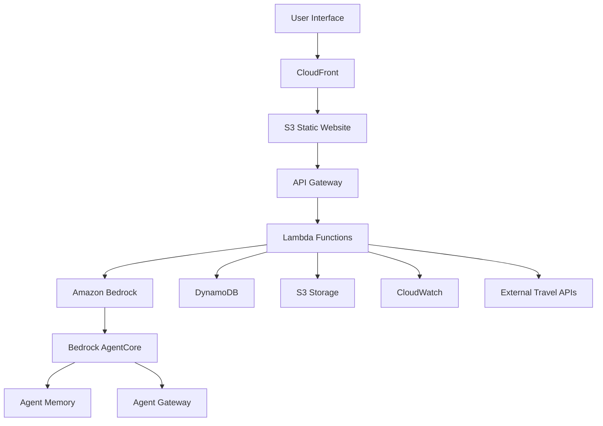

# Design Document

## Overview

The Autonomous Travel Companion is a serverless AI-powered travel planning system built on AWS. The architecture leverages Amazon Bedrock for AI capabilities, AWS Lambda for compute, and various AWS services for data storage and API management. The system follows a microservices pattern with clear separation between frontend, API layer, AI processing, and data persistence.

## Architecture

### High-Level Architecture



### AWS Services Configuration

#### Core Services
- **Amazon Bedrock**: Claude 3.5 Sonnet v2 for reasoning, Titan for embeddings
- **Bedrock AgentCore**: Memory, Gateway, and Observability primitives
- **API Gateway**: REST API with CORS enabled
- **AWS Lambda**: Node.js 18.x runtime with 512MB memory, 30s timeout
- **DynamoDB**: On-demand billing with GSI for user queries
- **S3**: Standard storage class with lifecycle policies
- **CloudWatch**: Logs retention 7 days, custom metrics

#### Security & Access
- **IAM Roles**: Least privilege access for Lambda execution
- **API Keys**: Rate limiting 1000 requests/hour per user
- **CORS**: Frontend domain whitelisting
- **Encryption**: S3 server-side encryption, DynamoDB encryption at rest

## Components and Interfaces

### Frontend Component (React/Next.js)

#### TripPlannerForm Component
```typescript
interface TripPreferences {
  destination: string;
  budget: number;
  duration: number; // days
  interests: string[];
  startDate: Date;
  travelers: number;
}

interface TripPlannerFormProps {
  onSubmit: (preferences: TripPreferences) => Promise<void>;
  loading: boolean;
}
```

#### ItineraryDisplay Component
```typescript
interface Itinerary {
  id: string;
  totalCost: number;
  days: DayPlan[];
  flights: FlightOption[];
  hotels: HotelOption[];
}

interface DayPlan {
  date: Date;
  activities: Activity[];
  meals: MealSuggestion[];
  transportation: TransportOption[];
}
```

### Backend API Layer

#### Trip Planning Lambda Function
```typescript
interface TripPlanRequest {
  preferences: TripPreferences;
  userId?: string;
}

interface TripPlanResponse {
  itinerary: Itinerary;
  s3Url: string;
  estimatedCost: number;
  confidence: number;
}
```

#### Booking Confirmation Lambda
```typescript
interface BookingRequest {
  itineraryId: string;
  selectedOptions: {
    flightId?: string;
    hotelId?: string;
    activityIds: string[];
  };
}

interface BookingResponse {
  confirmationNumber: string;
  bookingDetails: BookingConfirmation[];
  totalCost: number;
}
```

### AI Agent Architecture (Bedrock AgentCore)

#### Agent Configuration
```yaml
Agent:
  name: "TravelPlannerAgent"
  model: "anthropic.claude-3-5-sonnet-20241022-v2:0"
  instructions: |
    You are an expert travel planner. Create comprehensive itineraries based on user preferences.
    Consider budget constraints, travel logistics, and local recommendations.
    Provide structured responses with cost breakdowns and alternatives.
  
Memory:
  type: "session"
  maxTokens: 4000
  
Gateway:
  endpoints:
    - name: "FlightSearch"
      url: "${FLIGHT_API_ENDPOINT}"
    - name: "HotelSearch" 
      url: "${HOTEL_API_ENDPOINT}"
    - name: "ActivitySearch"
      url: "${ACTIVITY_API_ENDPOINT}"
```

#### Agent Prompt Templates
```typescript
const TRIP_PLANNING_PROMPT = `
Plan a ${duration}-day trip to ${destination} for ${travelers} travelers with a budget of $${budget}.

User interests: ${interests.join(', ')}
Start date: ${startDate}

Requirements:
1. Find flights within budget (max 40% of total budget)
2. Recommend hotels (max 35% of total budget)  
3. Suggest daily activities matching interests (remaining budget)
4. Create day-by-day itinerary with timing
5. Provide cost breakdown and alternatives

Response format: JSON with structured itinerary data
`;
```

## Data Models

### DynamoDB Tables

#### Users Table
```typescript
interface UserRecord {
  PK: string; // USER#${userId}
  SK: string; // PROFILE
  email: string;
  preferences: {
    defaultBudget: number;
    favoriteDestinations: string[];
    interests: string[];
    travelStyle: 'budget' | 'mid-range' | 'luxury';
  };
  createdAt: string;
  updatedAt: string;
}
```

#### Trips Table
```typescript
interface TripRecord {
  PK: string; // TRIP#${tripId}
  SK: string; // METADATA
  userId: string;
  destination: string;
  status: 'planning' | 'booked' | 'completed';
  preferences: TripPreferences;
  itinerary: Itinerary;
  totalCost: number;
  createdAt: string;
  bookedAt?: string;
}
```

#### Bookings Table
```typescript
interface BookingRecord {
  PK: string; // BOOKING#${bookingId}
  SK: string; // ${bookingType}#${providerId}
  tripId: string;
  type: 'flight' | 'hotel' | 'activity';
  confirmationNumber: string;
  details: FlightBooking | HotelBooking | ActivityBooking;
  cost: number;
  status: 'confirmed' | 'cancelled';
  createdAt: string;
}
```

### S3 Storage Structure
```
travel-companion-bucket/
├── itineraries/
│   ├── ${userId}/
│   │   └── ${tripId}/
│   │       ├── itinerary.json
│   │       ├── itinerary.pdf
│   │       └── booking-confirmations.json
├── user-uploads/
│   └── ${userId}/
│       └── profile-images/
└── static-assets/
    ├── destination-images/
    └── activity-photos/
```

## Error Handling

### API Error Responses
```typescript
interface ErrorResponse {
  error: {
    code: string;
    message: string;
    details?: any;
    requestId: string;
  };
  timestamp: string;
}

// Error Codes
const ERROR_CODES = {
  INVALID_INPUT: 'INVALID_INPUT',
  BUDGET_TOO_LOW: 'BUDGET_TOO_LOW', 
  NO_FLIGHTS_FOUND: 'NO_FLIGHTS_FOUND',
  BEDROCK_ERROR: 'BEDROCK_ERROR',
  EXTERNAL_API_ERROR: 'EXTERNAL_API_ERROR',
  RATE_LIMIT_EXCEEDED: 'RATE_LIMIT_EXCEEDED'
};
```

### Retry Logic
- **Bedrock API**: Exponential backoff, max 3 retries
- **External APIs**: Circuit breaker pattern, fallback to mock data
- **DynamoDB**: Built-in retry with AWS SDK
- **S3 Operations**: Automatic retry with exponential backoff

### Fallback Strategies
1. **External API Failure**: Switch to curated mock data
2. **Bedrock Unavailable**: Use pre-generated template responses
3. **Budget Constraints**: Suggest alternative dates/destinations
4. **No Results Found**: Expand search criteria automatically

## Testing Strategy

### Unit Testing
- **Frontend**: Jest + React Testing Library
- **Lambda Functions**: Jest with AWS SDK mocks
- **Bedrock Integration**: Mock Bedrock responses for deterministic tests

### Integration Testing
```typescript
describe('Trip Planning Flow', () => {
  test('should generate complete itinerary for valid input', async () => {
    const preferences = createMockPreferences();
    const response = await planTrip(preferences);
    
    expect(response.itinerary).toBeDefined();
    expect(response.itinerary.totalCost).toBeLessThanOrEqual(preferences.budget);
    expect(response.itinerary.days).toHaveLength(preferences.duration);
  });
  
  test('should handle budget constraints gracefully', async () => {
    const lowBudgetPreferences = createLowBudgetPreferences();
    const response = await planTrip(lowBudgetPreferences);
    
    expect(response.itinerary.flights).toContain('budget airline options');
    expect(response.itinerary.hotels).toContain('hostel or budget accommodation');
  });
});
```

### Load Testing
- **API Gateway**: 100 concurrent requests/second
- **Lambda**: Cold start performance under 3 seconds
- **Bedrock**: Rate limiting compliance testing
- **DynamoDB**: Read/write capacity scaling validation

### End-to-End Testing
```typescript
describe('Complete User Journey', () => {
  test('user can plan and mock-book a trip', async () => {
    // 1. Submit trip preferences
    const tripId = await submitTripPreferences(mockPreferences);
    
    // 2. Verify itinerary generation
    const itinerary = await getItinerary(tripId);
    expect(itinerary.status).toBe('ready');
    
    // 3. Mock booking confirmation
    const booking = await confirmBooking(tripId, selectedOptions);
    expect(booking.confirmationNumber).toBeDefined();
    
    // 4. Verify data persistence
    const savedTrip = await getTripFromDB(tripId);
    expect(savedTrip.status).toBe('booked');
  });
});
```

### AWS Resource Requirements

#### Estimated Costs (Development)
- **Bedrock**: ~$50/month (Claude 3.5 Sonnet v2 usage)
- **Lambda**: ~$10/month (1M requests)
- **DynamoDB**: ~$15/month (on-demand)
- **S3**: ~$5/month (100GB storage)
- **API Gateway**: ~$10/month (1M requests)
- **CloudWatch**: ~$5/month (logs + metrics)

**Total Estimated**: ~$95/month within $100 credit limit

#### Required IAM Permissions
```json
{
  "Version": "2012-10-17",
  "Statement": [
    {
      "Effect": "Allow",
      "Action": [
        "bedrock:InvokeModel",
        "bedrock:InvokeAgent",
        "bedrock:GetAgent",
        "bedrock:ListAgents"
      ],
      "Resource": "*"
    },
    {
      "Effect": "Allow", 
      "Action": [
        "dynamodb:GetItem",
        "dynamodb:PutItem",
        "dynamodb:UpdateItem",
        "dynamodb:Query",
        "dynamodb:Scan"
      ],
      "Resource": "arn:aws:dynamodb:*:*:table/TravelCompanion*"
    },
    {
      "Effect": "Allow",
      "Action": [
        "s3:GetObject",
        "s3:PutObject",
        "s3:DeleteObject"
      ],
      "Resource": "arn:aws:s3:::travel-companion-bucket/*"
    }
  ]
}
```