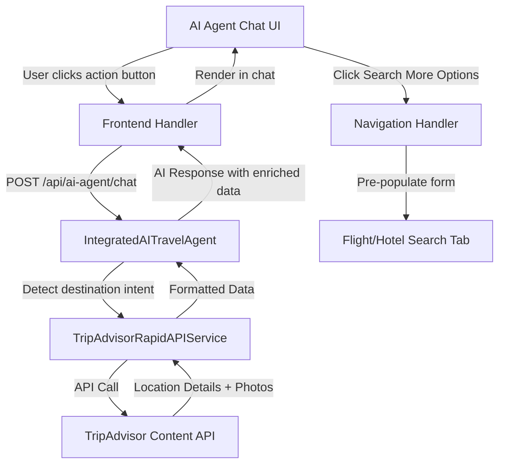

# Design Document

## Overview

This design document outlines the implementation of destination enrichment features for the AI Travel Assistant. The feature integrates TripAdvisor API to provide rich destination information (restaurants, activities, photos) after flight suggestions, and links the "Search More Options" button to the flight/hotel search tabs with pre-populated data.

The implementation leverages the existing architecture:
- **Frontend**: React/Next.js with TypeScript (ai-agent.tsx)
- **Backend**: Express.js with AWS Bedrock integration (IntegratedAITravelAgent)
- **APIs**: TripAdvisor Content API (already partially integrated via RapidAPI)
- **State Management**: Local React state with UserContextService

## Architecture

### High-Level Flow

```
User receives flight suggestions
    ↓
Frontend displays action buttons (Restaurants, Activities)
    ↓
User clicks button → Frontend sends request to backend
    ↓
Backend AI Agent detects intent and calls TripAdvisor API
    ↓
Backend formats response with location details and photos
    ↓
Frontend renders enriched content in chat
    ↓
User clicks "Search More Options" → Navigate to search tab with pre-filled data
```

### Component Interaction Diagram



## Components and Interfaces

### 1. Frontend Components

#### 1.1 Action Buttons Component

**Location**: `frontend/src/pages/ai-agent.tsx`

**Purpose**: Display contextual action buttons after flight suggestions

**Interface**:
```typescript
interface DestinationActionButtons {
  destination: string;
  origin?: string;
  dates?: {
    departure: string;
    return?: string;
  };
  onRestaurantsClick: (destination: string) => void;
  onActivitiesClick: (destination: string) => void;
  isDarkMode: boolean;
}
```

**Rendering Logic**:
- Detect when flight price comparison or flight options are displayed
- Extract destination name(s) from the message content
- Render buttons below each destination card
- Style consistently with existing UI (gradient buttons, hover effects)

#### 1.2 TripAdvisor Content Renderer

**Purpose**: Display location details and photos in a visually appealing format

**Interface**:
```typescript
interface LocationDetails {
  name: string;
  description: string;
  rating: number;
  reviewCount: number;
  address: string;
  phone?: string;
  website?: string;
  hours?: string;
  photos: Photo[];
  amenities?: string[];
  cuisine?: string[];
}

interface Photo {
  thumbnail: string;
  small: string;
  medium: string;
  large: string;
  caption?: string;
}
```

**Rendering Features**:
- Collapsible sections for long descriptions
- Star rating display with visual stars
- Photo gallery with lightbox/modal view
- Responsive grid layout (1 column mobile, 2-3 columns desktop)
- Dark mode support

#### 1.3 Search Navigation Handler

**Purpose**: Navigate to flight/hotel search tabs with pre-populated data

**Implementation**:
```typescript
const handleSearchMoreOptions = (searchParams: {
  origin: string;
  destination: string;
  departureDate: string;
  returnDate?: string;
  type: 'flight' | 'hotel';
}) => {
  // Store search params in UserContextService
  UserContextService.setSearchContext(searchParams);
  
  // Navigate to appropriate tab
  if (searchParams.type === 'flight') {
    router.push('/flights');
  } else {
    router.push('/hotels');
  }
};
```

### 2. Backend Services

#### 2.1 Enhanced IntegratedAITravelAgent

**Location**: `backend_test/services/IntegratedAITravelAgent.js`

**New Methods**:

```javascript
/**
 * Detect if user wants destination information
 */
detectDestinationIntent(message, context) {
  const lowerMsg = message.toLowerCase();
  
  return {
    wantsRestaurants: /restaurant|food|dining|eat|cuisine/i.test(lowerMsg),
    wantsActivities: /activity|activities|things to do|attractions|sightseeing/i.test(lowerMsg),
    wantsPhotos: /photo|picture|image|show me|what.*look like/i.test(lowerMsg),
    destination: this.extractDestination(message, context)
  };
}

/**
 * Fetch and format destination enrichment data
 */
async enrichDestinationInfo(destination, type = 'restaurants') {
  try {
    // Search for location
    const searchResults = type === 'restaurants' 
      ? await this.tripAdvisorService.searchRestaurants(destination, 5)
      : await this.tripAdvisorService.searchAttractions(destination, 5);
    
    if (!searchResults || searchResults.length === 0) {
      return {
        success: false,
        message: `I couldn't find ${type} information for ${destination}. Would you like to try a different destination?`
      };
    }
    
    // Get details and photos for top results
    const enrichedResults = await Promise.all(
      searchResults.slice(0, 3).map(async (location) => {
        const details = await this.tripAdvisorService.getLocationDetails(location.location_id);
        const photos = await this.tripAdvisorService.getLocationPhotos(location.location_id, 5);
        
        return {
          ...details,
          photos: photos || []
        };
      })
    );
    
    return {
      success: true,
      destination,
      type,
      results: enrichedResults
    };
  } catch (error) {
    console.error('Error enriching destination:', error);
    return {
      success: false,
      message: `I encountered an issue fetching ${type} for ${destination}. Please try again.`
    };
  }
}

/**
 * Format destination data for AI response
 */
formatDestinationResponse(enrichmentData) {
  if (!enrichmentData.success) {
    return enrichmentData.message;
  }
  
  const { destination, type, results } = enrichmentData;
  
  let response = `Here are some popular ${type} in ${destination}:\n\n`;
  
  results.forEach((location, index) => {
    response += `${index + 1}. **${location.name}**\n`;
    if (location.rating) {
      response += `   ⭐ Rating: ${location.rating}/5 (${location.num_reviews} reviews)\n`;
    }
    if (location.description) {
      const shortDesc = location.description.substring(0, 150);
      response += `   ${shortDesc}${location.description.length > 150 ? '...' : ''}\n`;
    }
    if (location.address) {
      response += `   📍 ${location.address}\n`;
    }
    if (location.cuisine && location.cuisine.length > 0) {
      response += `   🍽️ Cuisine: ${location.cuisine.join(', ')}\n`;
    }
    if (location.price_level) {
      response += `   💰 Price: ${location.price_level}\n`;
    }
    response += '\n';
  });
  
  return response;
}
```

#### 2.2 TripAdvisorRapidAPIService Enhancements

**Location**: `backend_test/services/TripAdvisorRapidAPIService.js`

**New Methods**:

```javascript
/**
 * Get location details using TripAdvisor Content API
 */
async getLocationDetails(locationId) {
  try {
    const response = await axios.get(
      `https://api.content.tripadvisor.com/api/v1/location/${locationId}/details`,
      {
        params: {
          key: process.env.TRIPADVISOR_API_KEY,
          language: 'en',
          currency: 'USD'
        }
      }
    );
    
    return this.formatLocationDetails(response.data);
  } catch (error) {
    console.error('TripAdvisor API error:', error);
    throw error;
  }
}

/**
 * Get location photos
 */
async getLocationPhotos(locationId, limit = 5) {
  try {
    const response = await axios.get(
      `https://api.content.tripadvisor.com/api/v1/location/${locationId}/photos`,
      {
        params: {
          key: process.env.TRIPADVISOR_API_KEY,
          language: 'en',
          limit
        }
      }
    );
    
    return response.data.data.map(photo => ({
      thumbnail: photo.images.thumbnail.url,
      small: photo.images.small.url,
      medium: photo.images.medium.url,
      large: photo.images.large.url,
      caption: photo.caption
    }));
  } catch (error) {
    console.error('TripAdvisor Photos API error:', error);
    return [];
  }
}

/**
 * Format location details for consistent response
 */
formatLocationDetails(data) {
  return {
    location_id: data.location_id,
    name: data.name,
    description: data.description,
    rating: data.rating,
    num_reviews: data.num_reviews,
    address: data.address_obj?.address_string || '',
    phone: data.phone,
    website: data.website,
    hours: data.hours?.weekday_text?.join(', '),
    amenities: data.amenities || [],
    cuisine: data.cuisine?.map(c => c.name) || [],
    price_level: data.price_level,
    latitude: data.latitude,
    longitude: data.longitude
  };
}
```

#### 2.3 New API Endpoints

**Location**: `backend_test/routes/tripadvisor.js`

**Endpoints to Add**:

```javascript
/**
 * GET /api/tripadvisor/location/:locationId/details
 * Get comprehensive location details
 */
router.get('/location/:locationId/details', async (req, res) => {
  try {
    const { locationId } = req.params;
    const details = await tripAdvisorService.getLocationDetails(locationId);
    
    res.json({
      success: true,
      data: details,
      timestamp: new Date().toISOString()
    });
  } catch (error) {
    res.status(500).json({
      success: false,
      error: error.message
    });
  }
});

/**
 * GET /api/tripadvisor/location/:locationId/photos
 * Get location photos
 */
router.get('/location/:locationId/photos', async (req, res) => {
  try {
    const { locationId } = req.params;
    const limit = parseInt(req.query.limit) || 5;
    const photos = await tripAdvisorService.getLocationPhotos(locationId, limit);
    
    res.json({
      success: true,
      data: photos,
      timestamp: new Date().toISOString()
    });
  } catch (error) {
    res.status(500).json({
      success: false,
      error: error.message
    });
  }
});
```

### 3. Data Models

#### 3.1 Message Enhancement

**Extend existing Message interface**:

```typescript
interface Message {
  role: 'user' | 'ai' | 'system';
  content: string | Record<string, any>;
  timestamp: number;
  id: string;
  
  // New fields
  destinationActions?: {
    destination: string;
    origin?: string;
    dates?: {
      departure: string;
      return?: string;
    };
  };
  
  locationEnrichment?: {
    type: 'restaurants' | 'activities';
    locations: LocationDetails[];
  };
  
  googleFlightsButton?: {
    text: string;
    url: string;
    type: string;
    searchParams?: {
      origin: string;
      destination: string;
      departureDate: string;
      returnDate?: string;
    };
  };
}
```

#### 3.2 User Context Enhancement

**Extend UserContext in IntegratedAITravelAgent**:

```javascript
{
  sessionId: string,
  preferences: {...},
  searchHistory: [...],
  
  // New fields
  currentDestinations: [
    {
      name: string,
      origin?: string,
      dates?: {
        departure: string,
        return?: string
      },
      discussedAt: timestamp
    }
  ],
  
  lastSearchParams: {
    type: 'flight' | 'hotel',
    origin: string,
    destination: string,
    dates: {...}
  }
}
```

## Error Handling

### 1. API Failures

**Strategy**: Graceful degradation with user-friendly messages

```javascript
try {
  const details = await tripAdvisorService.getLocationDetails(locationId);
} catch (error) {
  if (error.response?.status === 404) {
    return "I couldn't find details for that location. Would you like to try a different place?";
  } else if (error.response?.status === 429) {
    return "I'm experiencing high demand right now. Please try again in a moment.";
  } else {
    return "I encountered a technical issue. Let me help you with something else!";
  }
}
```

### 2. Missing Context

**Strategy**: Prompt user for clarification

```javascript
if (!destination || destination.length === 0) {
  return "Which destination would you like to explore? Please let me know the city or location.";
}
```

### 3. Network Errors

**Strategy**: Retry with exponential backoff

```javascript
async function fetchWithRetry(fn, maxRetries = 3) {
  for (let i = 0; i < maxRetries; i++) {
    try {
      return await fn();
    } catch (error) {
      if (i === maxRetries - 1) throw error;
      await new Promise(resolve => setTimeout(resolve, Math.pow(2, i) * 1000));
    }
  }
}
```

## Testing Strategy

### 1. Unit Tests

**Frontend**:
- Test action button rendering logic
- Test destination extraction from messages
- Test navigation handler with mock router
- Test photo gallery component

**Backend**:
- Test intent detection with various message patterns
- Test TripAdvisor API response formatting
- Test error handling for API failures
- Test context extraction and storage

### 2. Integration Tests

- Test end-to-end flow: user message → API call → response rendering
- Test "Search More Options" navigation with pre-populated data
- Test TripAdvisor API integration with real API calls (using test API key)
- Test conversation context persistence across multiple messages

### 3. UI/UX Tests

- Test responsive layout on mobile, tablet, desktop
- Test dark mode rendering for all new components
- Test accessibility (keyboard navigation, screen readers)
- Test loading states and error messages

### 4. Performance Tests

- Test API response times
- Test caching effectiveness
- Test concurrent API calls handling
- Test large photo gallery rendering

## Security Considerations

### 1. API Key Protection

- Store TripAdvisor API key in environment variables
- Never expose API keys in frontend code
- Implement rate limiting on backend endpoints

### 2. Input Validation

- Sanitize user input before making API calls
- Validate location IDs before querying TripAdvisor
- Prevent injection attacks in search queries

### 3. CORS Configuration

- Maintain existing CORS policy
- Only allow requests from authorized frontend domains

### 4. Data Privacy

- Don't log sensitive user information
- Comply with TripAdvisor's terms of service for data usage
- Implement proper attribution for TripAdvisor content

## Performance Optimization

### 1. Caching Strategy

```javascript
// In-memory cache with TTL
const locationCache = new Map();
const CACHE_TTL = 3600000; // 1 hour

async function getCachedLocationDetails(locationId) {
  const cached = locationCache.get(locationId);
  if (cached && Date.now() - cached.timestamp < CACHE_TTL) {
    return cached.data;
  }
  
  const data = await tripAdvisorService.getLocationDetails(locationId);
  locationCache.set(locationId, { data, timestamp: Date.now() });
  return data;
}
```

### 2. Lazy Loading

- Load photos only when user scrolls to them
- Implement progressive image loading (blur-up technique)
- Use thumbnail images initially, load full-size on demand

### 3. Batch Requests

- Fetch multiple location details in parallel using Promise.all()
- Limit concurrent API calls to avoid rate limiting

### 4. Frontend Optimization

- Memoize expensive computations (destination extraction)
- Use React.memo for action button components
- Debounce user interactions to prevent excessive API calls

## Deployment Considerations

### 1. Environment Variables

Add to `.env`:
```
TRIPADVISOR_API_KEY=your_api_key_here
TRIPADVISOR_CACHE_TTL=3600000
```

### 2. Backward Compatibility

- Ensure existing chat functionality continues to work
- Gracefully handle missing TripAdvisor API key (disable features)
- Maintain existing message format for non-enriched responses

### 3. Monitoring

- Log TripAdvisor API usage and response times
- Track error rates for API calls
- Monitor user engagement with destination action buttons

### 4. Rollback Plan

- Feature can be disabled via environment variable
- Frontend gracefully hides action buttons if backend doesn't support them
- No database schema changes required (using existing context storage)
